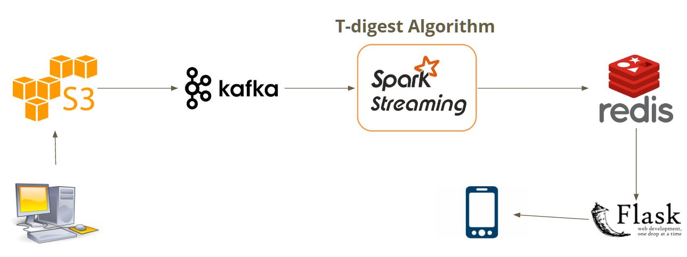
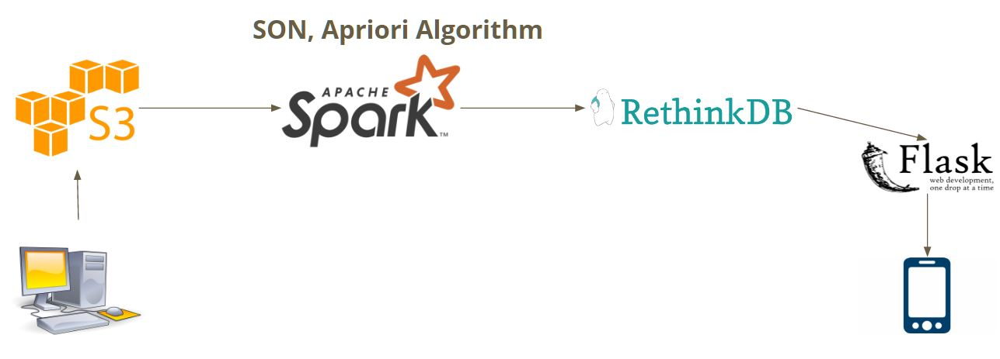

Insight Data Engineering Project

# PetGo Analytics
Pet lovers like you also bought...

## Project Links

 * [Slides][slides]
 * [Live Demo][demo]

## Outline

1. [Project Overview](README.md#1-introduction)
2. [The Pipeline](README.md#2-the-pipeline)
 * 2.1 [Data Generation](README.md#21-data-generation)
 * 2.2 [Stream Processing and Data Storage](README.md#22-stream-processing-and-data-storage)
 * 2.3 [Batch Processing and Data Storage](README.md#23-batch-processing-and-data-storage)
 * 2.4 [UI Server](README.md#24-ui-server)
3. [Performance](README.md#3-performance)

## 1. Project Overview

Amazon has recently announced their idea for the store of the future, called Amazon Go. This is a store with no cashiers, so if you want to purchase an item you simply take it off the shelf and you are automatically charged for it. If you don't want an item, you put it back on the shelf and are refunded. For my project I simulated a pet store version of Amazon Go, called PetGo.

You can imagine that Amazon would want to have the same features that make their website so popular also in their futuristic store. The two features I decided to implement were:

 * Identify what are the frequently bought items (e.g., top 10% of items purchased)
 * Recommend items that are commonly bought together (e.g., Amazon's "people who bought this item also bought..." feature)

There are two main use cases for these features. First, it offers customers a better shopping experience, as they can learn what items are most popular and can get recommendations about items they may have not known about. Second, it allows the business to offer deals and recommendations to customers while they are shopping based on what is currently in their cart.

## 2. The Pipeline

There is both a Batch and Streaming component to the pipeline. Both batch and streaming use the same data stored in S3. Kafka is used to simulate streaming data. Spark is used for both the batch and streaming processing. The results of the streaming processing are stored in Redis, and the results 

### 2.1 Data Generation

[Source](DataGeneration)

Data was generated using the Apache BigTop project. Data was generated in the format of one customer transaction per line. Below is an example. 

~~~
1,18.435959704338224,6,33610,0,Khyana Riding,48073,category=dry cat food;brand=Pretty Cat;flavor=Tuna;size=7.0;per_unit_cost=2.86;
2,36.78793297494155,3,84123,0,Khyana Riding,48073,category=dry cat food;brand=Feisty Feline;flavor=Chicken & Rice (Hairball Management);size=14.0;per_unit_cost=2.14;
3,73.15212064816562,3,84123,0,Khyana Riding,48073,category=dry cat food;brand=Feisty Feline;flavor=Chicken & Rice (Hairball Management);size=14.0;per_unit_cost=2.14;
4,87.42629969938072,5,84015,0,Khyana Riding,48073,category=dry dog food;brand=Happy Pup;flavor=Chicken;size=15.0;per_unit_cost=2.67;
4,87.42629969938072,5,84015,0,Khyana Riding,48073,category=kitty litter;brand=Feisty Feline;size=28.0;per_unit_cost=1.5;
~~~

After the data was generated, it was uploaded to S3.

### 2.2 Stream Processing and Data Storage

[Source](Spark/Batch)

This section will cover the tools of the pipeline involved in streaming processing. The streaming component is used to find what the top 10% of items purchased are. First, Kafka is used to ingest the data stored in S3. Rather than reading the data directly from S3, Kafka was used so that the data could be simulated as streaming. Next, Spark Streaming consumes the data in the Kafka topic as a streaming RDD. There are two steps in the Spark Streaming processing:

1. Each record in the incoming data represents one transaction (i.e., one item bought by one customer). The data is transformed into a different format where one record represents an item and the total number of people who purchased that item.
2. The t-digest algorithm is run on the resulting dstream from step 1 on each node. This algorithm runs in a distributed manner and finds the threshold for an item to belong to the specified quartile (in this case top 10%).

After the processing is finished, all of the items and their counts are stored in Redis as key-value pairs. The threshold value found in step 2 is stored as well.

 
### 2.3 Batch Processing and Data Storage

[Source](Spark/Batch)

This section will cover the tools of the pipeline involved in batch processing. The batch component is used to find what the frequent itemsets are. The data is read directly from S3 into Spark. There are several steps in the Spark batch processing:

1. ?
2. ?

 

### 2.4 UI Server

[Source](Flask)

The UI is built as a Flask web app, with
visualizations built using Highcharts (javascript). This app is served by a Tornado web server that uses
a timeout every 15 seconds to refresh the data. The server recieves new data frames via Redis and RehtinkDB. 

 

## 3. Performance

Coming Soon

See the [TESTING][testing] document for results on Spark Streaming algorithm performance.

 

[demo]: http://www.petgoanalytics.us/
[slides]: http://goo.gl/FTW14K
[testing]: TESTING.md
