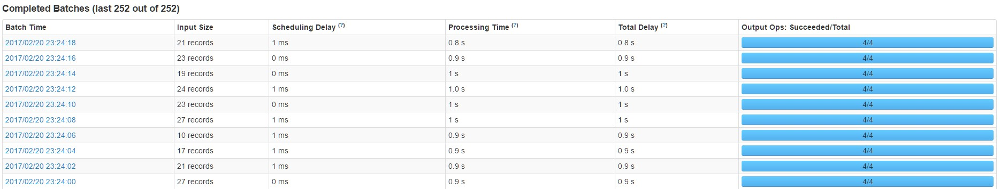
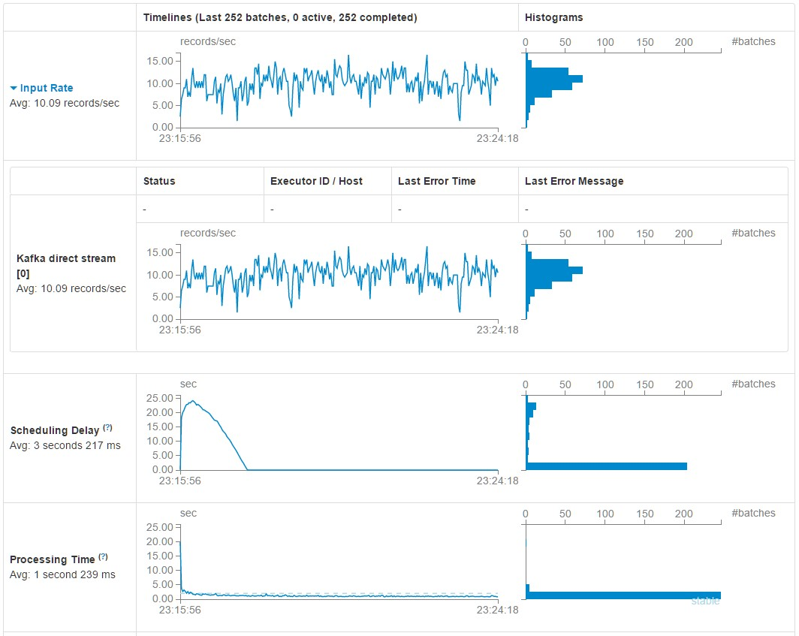
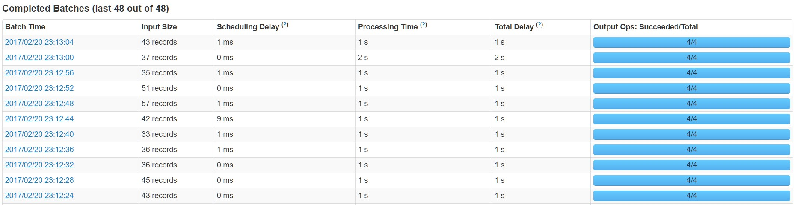
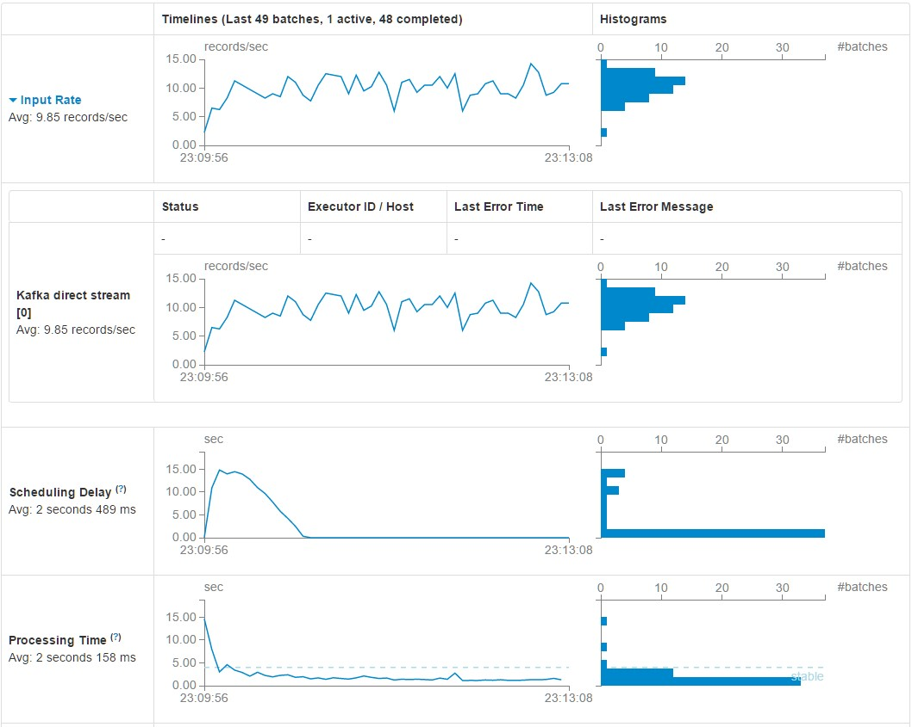
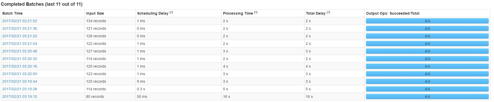
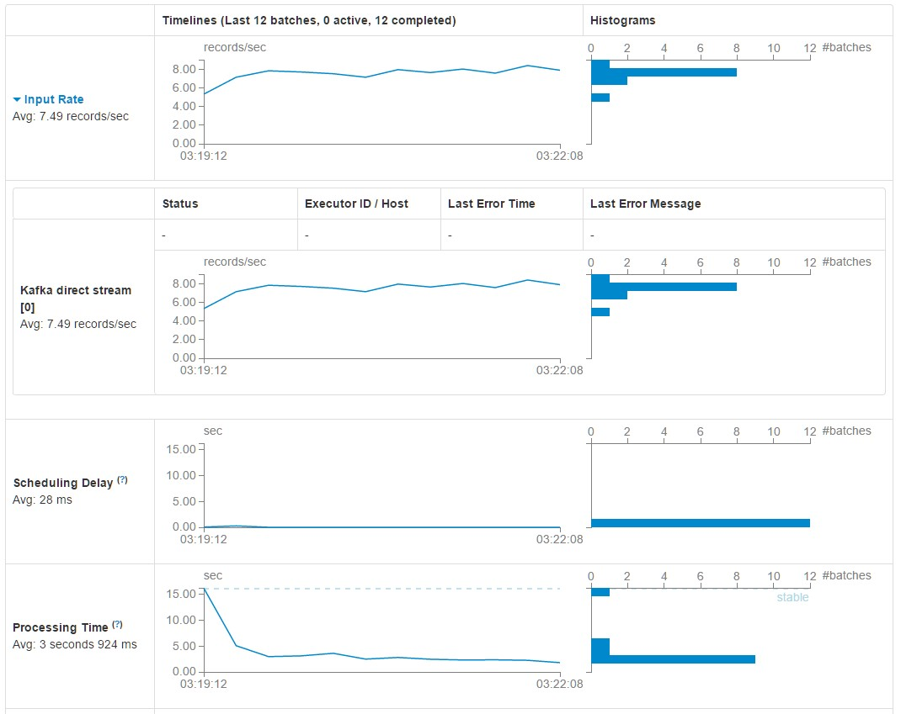

# TDigest Streaming Runtime Analysis

The amount of records processed by Spark Streaming from Kafka was recorded as the window size was increased. Based on the results shown below, it can be seen that the amount of data the algorithm can process scales linearly. 

## 2 sec window Results

## 4 sec window Results

## 16 sec window Results

